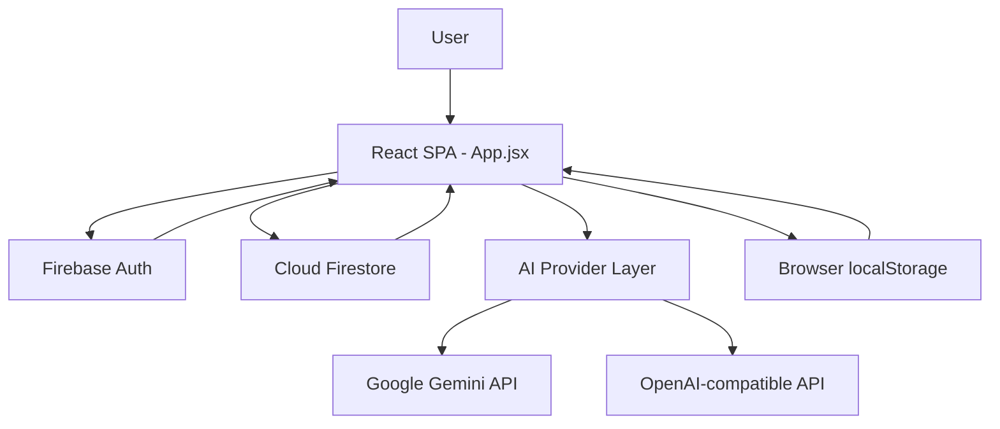

# tu-tien-quiz


AI-powered quiz generation and practice platform with cultivation-themed gamification.

## Table of Contents

- [Overview](#overview)
- [Architecture](#architecture)
- [Features](#features)
- [Tech Stack](#tech-stack)
- [Prerequisites](#prerequisites)
- [Installation](#installation)
- [Configuration](#configuration)
- [Usage](#usage)
- [Project Structure](#project-structure)
- [Development](#development)
- [License](#license)

## Overview

`tu-tien-quiz` is a single-page React application that helps users convert pasted study material into AI-generated multiple-choice quizzes. It combines Firebase authentication/data storage with a configurable AI provider layer (Gemini by default, OpenAI-compatible providers optional) and a gamified progression system. The app is designed to support iterative learning: generate questions by semantic segment, run quiz sessions, track weak areas, and continuously improve.

The core problem it solves is reducing manual work in creating test-quality questions from dense learning content while preserving progress history and study continuity.

Key differentiators in this implementation:
- Semantic segmentation before question generation (with local fallback segmentation).
- Multi-provider AI integration with retry/backoff and API connectivity checks.
- Built-in learning loop features (wrong-answer review, mastered tracking, autosave/resume, XP/level progression).

## Architecture



Main components/modules and roles:
- `src/main.jsx`: React entry point and app bootstrap.
- `src/App.jsx`: Primary application logic, UI rendering, quiz engine, queue processing, AI orchestration, settings management.
- `src/firebase.js`: Firebase app initialization and exported services (`db`, `auth`, `googleProvider`).
- `tailwind.config.js` + `src/index.css`: theme system, custom tokens/animations, and UI styling rules.
- `vite.config.js`: Vite + React plugin build/dev configuration.

Data flow:
1. User authenticates via Google (`Firebase Auth`).
2. App subscribes to user-scoped Firestore documents (`documents`, `questions`, `stats`, `settings`).
3. User uploads/pastes study content; app segments content and persists chapter/segment data.
4. Generation jobs call configured AI provider and write normalized questions to Firestore.
5. Quiz sessions update local in-progress state and persist final outcomes (XP/history/wrong/mastered) via Firestore transactions.
6. Autosave/session pools are maintained in `localStorage` for resume and depletion control.

## Features

- Google Sign-In authentication with per-user isolated data.
- Real-time Firestore sync for documents, questions, user stats, and settings.
- AI-powered semantic document segmentation.
- AI-generated quiz questions with:
  - Difficulty distribution control (`easy`, `medium`, `hard`).
  - Single-answer and multiple-answer question formats.
  - Bloom-level tagging support.
  - Duplicate-avoidance prompt context from existing questions.
- Background job queue for generation with progress widget, retry state, and stop control.
- Advanced question generation mode for Bloom L4-L6 and knowledge extension.
- In-app chapter summarization and mnemonic generation.
- Quiz modes: standard random, full unmastered set, wrong-answer review, session review.
- Session autosave/resume support and keyboard shortcuts during quiz.
- Gamification: XP gain, level progression, streak tracking, and breakthrough/tribulation mechanic.
- Import/export user learning data (JSON backup/restore).
- Theme switching (dark/light) and AI output language control (`auto`, `vi`, `en`).
- API connection testing for both Gemini and OpenAI-compatible endpoints.

## Tech Stack

| Component | Technology | Version |
|---|---|---|
| Frontend framework | React | `^18.3.1` |
| DOM renderer | react-dom | `^18.3.1` |
| Build tool / dev server | Vite | `^5.3.1` |
| Vite React plugin | @vitejs/plugin-react | `^4.3.1` |
| Styling framework | Tailwind CSS | `^3.4.19` |
| CSS processing | PostCSS | `^8.5.9` |
| CSS vendor prefixing | Autoprefixer | `^10.5.0` |
| Backend services SDK | Firebase | `^10.12.0` |
| Icon library | lucide-react | `^0.400.0` |

## Prerequisites

- Node.js: **not pinned in repository metadata** (`package.json` has no `engines` field).
- npm: required to install dependencies and run scripts.
- Firebase project with enabled services used by code:
  - Authentication (Google provider)
  - Cloud Firestore
  - Analytics (web)
- AI provider key entered in app settings/onboarding:
  - Gemini API key (default), or
  - OpenAI-compatible API key + Base URL + Model ID

## Installation

```bash
# 1) Clone the repository
git clone https://github.com/nnt7733/quiz.git
cd quiz

# 2) Install dependencies
npm install

# 3) Create environment file
cp .env.example .env

# 4) Run development server
npm run dev
```

> This project is JavaScript/Vite-based and does not use a Python virtual environment.

## Configuration

Create `.env.example` (and copy to `.env`) with all environment variables referenced in code:

```env
# Firebase Web API key for initializeApp()
VITE_FIREBASE_API_KEY=

# Firebase Auth domain (e.g., your-project.firebaseapp.com)
VITE_FIREBASE_AUTH_DOMAIN=

# Firebase project ID
VITE_FIREBASE_PROJECT_ID=

# Firebase Storage bucket
VITE_FIREBASE_STORAGE_BUCKET=

# Firebase Cloud Messaging sender ID
VITE_FIREBASE_MESSAGING_SENDER_ID=

# Firebase Web App ID
VITE_FIREBASE_APP_ID=

# Firebase Analytics measurement ID
VITE_FIREBASE_MEASUREMENT_ID=
```

## Usage

### Example 1: Start the app locally

```bash
npm run dev
```

Open the local Vite URL shown in terminal, sign in with Google, then paste content in **Upload** screen to generate quiz material.

### Example 2: AI question generation call (from app code)

```javascript
const rawRes = await generateText(prompt, s);
const newQsRaw = await safeParseJSONArray(rawRes, s);
const newQsNormalized = newQsRaw.map(normalizeGeneratedQuestion)
  .filter(q => q.options.length > 0 && q.correctAnswers.length > 0);
```

This is the core generation flow used by queued jobs in `src/App.jsx`.

### Example 3: Persist uploaded document after segmentation

```javascript
const segments = await segmentDocumentWithAI(text, settings);
const docRef = doc(collection(db, docsCol(user.uid)));
await setDoc(docRef, {
  title: title || "Tâm Pháp Mới",
  chapters: [{ id: generateId(), title: title || "Nội dung chính", content: text.trim(), segments }],
  createdAt: Date.now()
});
```

This flow stores user material and semantic segments in Firestore for later quiz generation.

## Project Structure

```text
my-quiz-project/
├── index.html              # Root HTML template and app metadata
├── package.json            # Project metadata, scripts, and dependencies
├── package-lock.json       # Locked npm dependency graph
├── postcss.config.js       # PostCSS plugin configuration
├── tailwind.config.js      # Tailwind theme and content scanning setup
├── vite.config.js          # Vite bundler configuration
├── src/
│   ├── App.jsx             # Main UI + business logic (auth, AI, quiz, queue, settings)
│   ├── firebase.js         # Firebase initialization and exported service clients
│   ├── index.css           # Global styles, theme variables, and custom animations
│   └── main.jsx            # React app mount entry
└── README.md               # Project documentation
```

## Development

Run locally:

```bash
npm run dev
```

Build production bundle:

```bash
npm run build
```

Preview production build:

```bash
npm run preview
```

Testing/linting/formatting:
- No test scripts are currently defined in `package.json`.
- No lint or format scripts are currently defined in `package.json`.

## License

No `LICENSE` file or `license` field is currently defined in `package.json`; this repository is effectively unlicensed unless the owner adds explicit license terms.